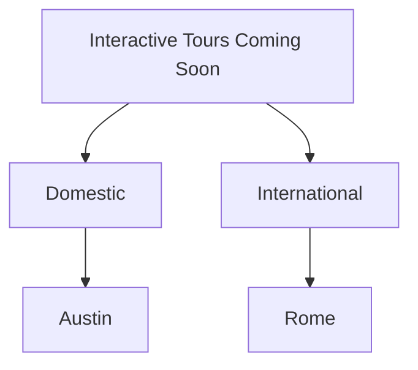

## Accordion

<Accordion title="New Tours Coming Soon" icon="fa-smile">
  Now you can add content as a dropdown!
</Accordion>

## Columns

<Columns layout="auto">
  <Column>
    This is column 1!
  </Column>

  <Column>
    You can also include Markdown syntax, such as *italicizing*
  </Column>

  <Column>
    > You can also make a callout within a column!
  </Column>
</Columns>

## Mermaid.js Diagrams

