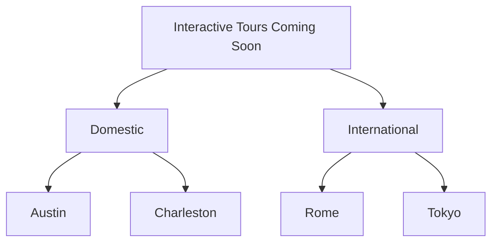

export const myVariable = "hello";

## Get to Know a New City with Owlbert as Your Guide!

Owlbert is an ideal travel companion who makes exploring a new city even more fun, and informative! {myVariable}

With real-time, location-based updates, Owlbert can offer a truly dynamic experience—like suggesting a nearby café when you are in the vicinity or providing historical context when you approach landmarks.

<Image align="center" border={false} caption="That's Owlbert! He's whip smart and chock full of local facts and recommendations!" src="https://files.readme.io/1933e19ad3e01a46ca7ac4945b4ec49c59464ef68e11751e5cd960b08c748ae6-Nametag.psd.full.png" width="25% " />

## Why Integrate with Owlbert's Journeys?

Owlbert’s Journeys offers a unique way to explore cities through immersive, location-based tours guided by Owlbert, our friendly cartoon (but very human-like!) owl. By integrating with Owlbert’s Journeys, you get instant access to interactive, engaging experiences that bring city sights to life—whether you're navigating vibrant streets, searching for hidden culinary gems, or learning fascinating local history.

### Benefits of Interactive Tours with Owlbert

* :classical_building: **Beyond the Guide Book**: Owlbert doesn’t just provide directions; he shares stories, local insights, and fun facts about each location, creating a more memorable experience than a typical tour. Each suggestion—whether it’s a historic landmark or a hidden café—is tailored and personalized, allowing you to get to know a place better.
* :pushpin:**Location-Aware Recommendations**: Owlbert’s Journeys API offers real-time, location-based tips, letting you discover nearby highlights as you explore. If you're approaching a well-known landmark, for example, Owlbert might push an in-app notification to share its backstory. If you're feeling peckish, Owlbert can suggest a nearby restaurant with a signature dish that you won’t want to miss.
* :unicorn:**Customizable Experiences**: With various tour options—walking, biking, or even interactive multimedia tours—you can choose an experience that fits how you like to explore best. For app developers, integrating Owlbert’s Journeys API adds seamless options for travelers to find new experiences right at their fingertips, without ever having to leave the app.

## Find a Tour

Whether you're traveling soon or want to explore your home city more deeply, Owlbert offers tours across lots of major US and European cities. Don't see your city represented? Reach out to [community@owlbertsjourneys.io](mailto:community@owlbertsjourneys.io) and give your city some love! We're always working on creating more interactive guides and audio tours.

 

